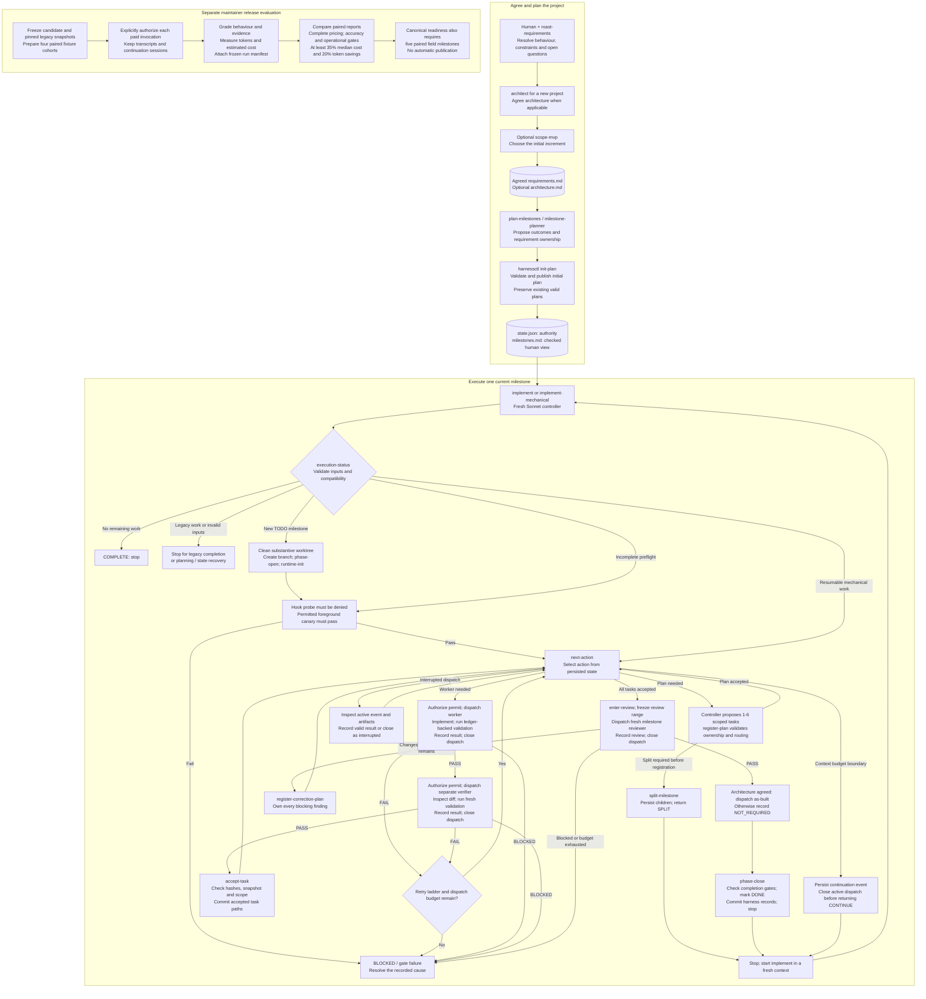

# harness

A Claude Code plugin for milestone implementation. A model controller coordinates
workers, separate verifiers, and milestone reviewers; Python commands validate
state transitions, evidence, task acceptance, and persisted retry budgets.
“Mechanical” describes those command-level checks, not a model-free runner.

This branch contains the mechanical cutover candidate. Canonical release remains
pending the cost/accuracy evidence in
[the cutover plan](docs/mechanical-cutover-plan.md); local tests alone do not
establish savings or promotion readiness.

## Architecture and workflow diagrams

The diagram shows the intended controller protocol and the command gates it uses.
Dispatches run in the foreground. Resume paths read persisted state rather than
starting the milestone again. Release evaluation is a separate maintainer process,
not a step that runs after every user milestone.



Worker/verifier retries follow the registered ladder: Cheap → Cheap → Mid → Top,
Mid → Top, or Top only. Interruption also consumes dispatch capacity; a fresh
context does not reset budgets. Optional advisor calls are limited to two per
milestone and cannot override failed command gates. Resume can also go directly
to verification, acceptance, review, or closure according to stored state.

Sources: [controller protocol](agents/mechanical-controller.md),
[state transitions](scripts/harnesslib/state.py),
[runtime permits](scripts/harnesslib/runtime.py),
[review and closure](scripts/harnesslib/review.py), and
[release comparator](.harness-dev/compare-harness-runs.py).

See [How the mechanical harness works](docs/mechanical-workflow.md) for detailed
diagrams of the full workflow, agent and script responsibilities, verification,
evidence storage, retries, recovery, model routing, and release gates.

## Install and prerequisites

```sh
CLAUDE_CODE_DISABLE_BACKGROUND_TASKS=1 claude --plugin-dir /path/to/this/repo
```

Python 3, Git, and a configured Claude Code installation are required. State
locking uses Python's Unix-only `fcntl` module; use a Unix-compatible environment.
The harness stores coordination data locally without its own service or database;
model calls still use the configured provider. Hooks and the live foreground canary
must pass preflight before planning tasks or dispatching product work.

The target must be a Git repository with a baseline commit and a clean
substantive worktree. The controller opens a milestone branch from HEAD. It
stops on existing product edits or missing Git prerequisites; resolve these
before resuming. Each independently accepted task is committed by harnessctl.
The defined workflow does not push, merge, delete branches, stash, or rewrite
history; these are protocol restrictions, not a shell sandbox.

## Workflow

1. `/harness:roast-requirements <rough requirement>` — resolve open questions.
2. For a new project, `/harness:architect` — agree components and boundaries.
3. Optionally `/harness:scope-mvp` — choose a minimal useful increment.
4. `/harness:plan-milestones` — create validated milestone ownership and state.
5. In a fresh context, `/harness:implement` — execute one current milestone.

Planning creates `.harness/state.json` (authority) and `.harness/milestones.md`
(human view). Every in-scope requirement has one owning milestone. No detailed
future task plans are generated. Requirements, tests, diffs and evidence are
authoritative; agent confidence is not.

`/harness:implement-mechanical` remains a compatibility entry point using the
same controller. Neither command falls back to legacy execution.

- DONE: the milestone passed independent checks and was closed; clear context
  before implementing the next milestone.
- SPLIT: smaller milestones were recorded; stop and start the first child fresh.
- CONTINUE: resume persisted work in a fresh context; budgets survive re-entry.
- BLOCKED: resolve the recorded decision or failed gate.
- COMPLETE: all in-scope work is complete; no further agent or project review runs.
- INTERRUPTED: a terminal contract was missing; it is never a successful result.

After a passing review, agreed architecture causes a per-milestone
`.harness/as-built/M<n>.md` record. The preceding milestone reviewer evaluates
code and affected interfaces; this record does not trigger another review. There is
no additional project-wide review or composed drift report.

## Existing projects

The planning skill preserves valid plans. If only milestones exist it uses the
existing state migration tool; ambiguous ownership requires an explicit map.
It never uses force to overwrite state. Missing views, inconsistent pairs, or
an initialization marker require recovery before execution.

The mechanical entry gate accepts clean TODO milestones and resumable mechanical
state. It rejects unfinished legacy tasks/reviews without creating a branch or
dispatching work. Finish those with the
[pinned legacy plugin](.harness-dev/legacy/README.md), then switch at a clean
milestone boundary. Completed legacy history is retained. No conversion invents
validation evidence. Do not run legacy execution over active mechanical state.

MVP scoping works before initial planning. Later increments can be agreed and
recorded, but activation into an existing mechanical plan remains blocked until
incremental planning is implemented; completed history is never replanned.

## Runtime records

- `.harness/requirements.md`, optional `architecture.md`: agreed input.
- `.harness/state.json`, `milestones.md`: authoritative state and checked view.
- `.harness/tasks/`, `results/`, `reviews/`: bounded packets and result artifacts.
- `.harness/evidence/`: hash-checked validation evidence and full output logs.
- `.harness/as-built/`: architecture observations when applicable.
- `.harness/mvp.md`, `full/`: scope decisions and preserved full-scope inputs.

See [runtime-contract.md](docs/runtime-contract.md) for ownership and recovery.
Use the supplied [initial plan example](examples/initial-plan.example.json) for
scripted planning; from the target project root,
`python3 /path/to/this/repo/scripts/harnessctl.py init-plan --plan <file>` validates
and publishes it.

## Current enforcement limits

- Hooks check dispatch permits and supported edit tools, but unrestricted shell
  commands can bypass edit restrictions. Harness records are ordinary writable
  files; hash checks detect certain changes, not all possible state tampering.
- The controller is instructed to use the routed model and separate agent
  contexts. Permits do not bind the actual model or agent identity, and recorded
  routing reflects the plan rather than verified execution telemetry.
- State and Markdown view updates use separate atomic file replacements, not one
  transaction. A process crash between writes can leave an inconsistent pair
  requiring recovery before execution resumes.
- The transcript analyser currently counts the required denied `sleep 0` hook
  probe as polling. This known false positive must be corrected before the
  zero-polling release gate can reliably assess normal mechanical runs.

These limits mean the workflow still relies on agent compliance. They do not
remove the command-level evidence, scope, and transition checks described above.

## Validation and measurement

```sh
for test_file in .harness-dev/test-*.py; do
  PYTHONDONTWRITEBYTECODE=1 python3 "$test_file" || exit 1
done
```

[`measure-context.py`](.harness-dev/measure-context.py) measures transcript-derived
tokens and estimated cost using its configured price map, not provider invoices.
Campaign reports include frozen run metadata; paired comparison rejects incomplete
pricing. The cost and token targets are release criteria, not demonstrated savings.
The [evaluation runbook](.harness-dev/mechanical-evaluation-runbook.md) pins the
legacy comparison commit and requires all four fixture pairs and five paired
field milestones before canonical promotion. Paid evaluation has its own
per-invocation authorization; no cutover test launches provider work.
