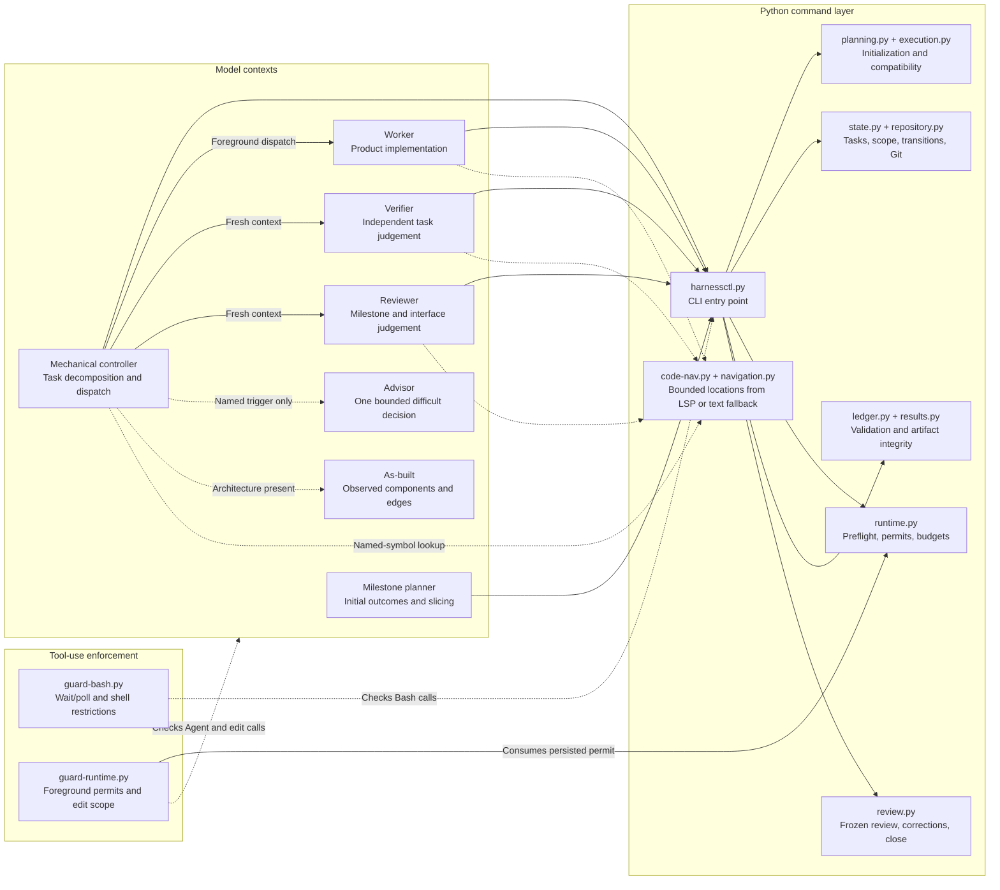
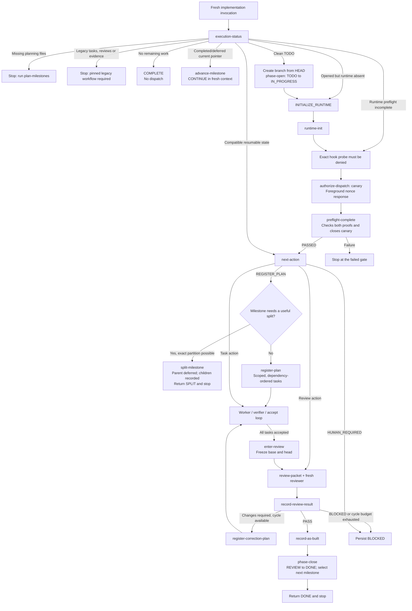
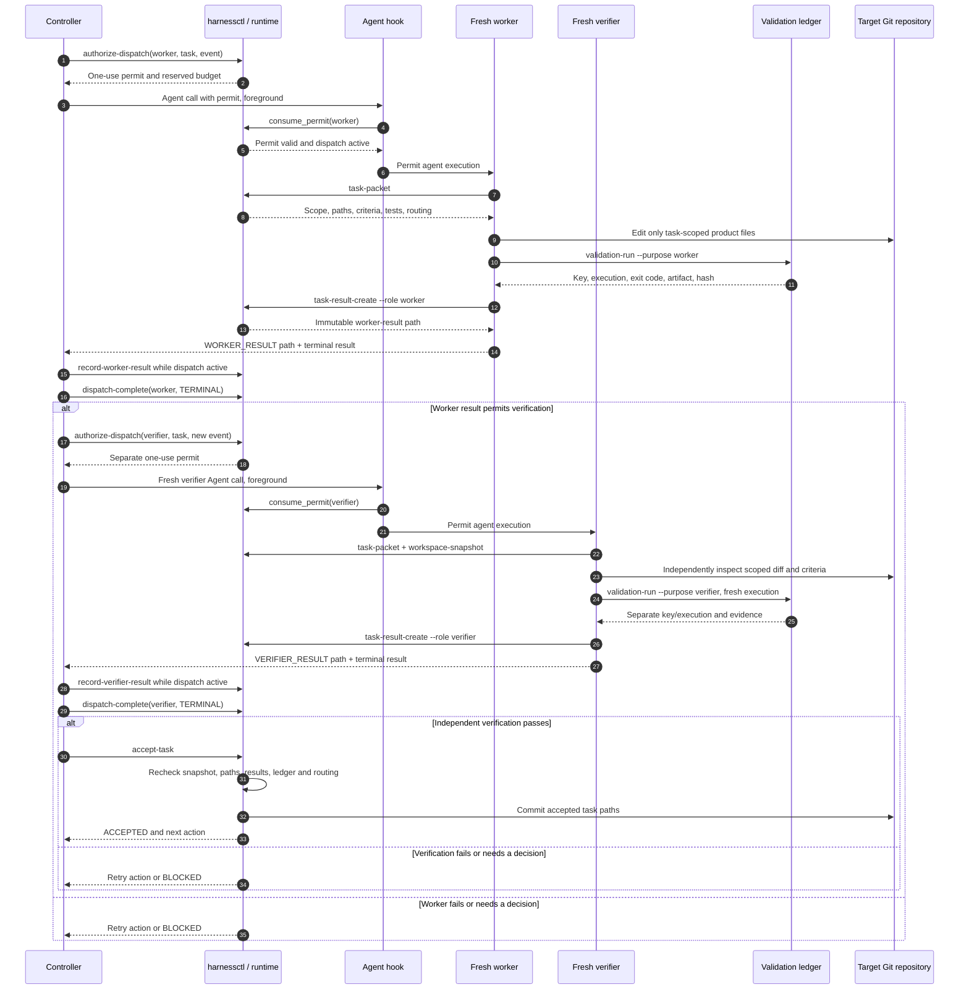
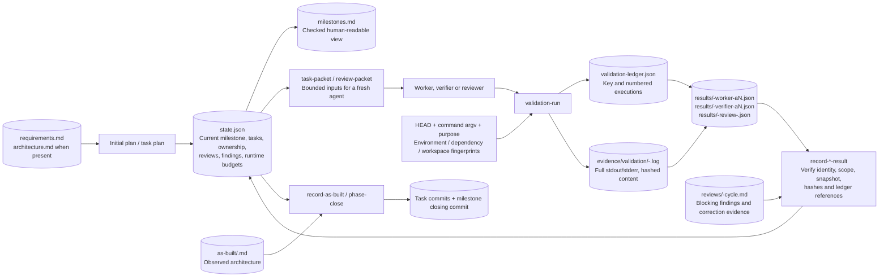
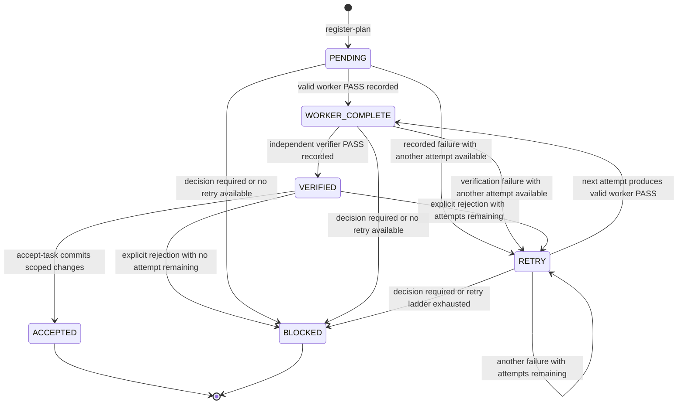
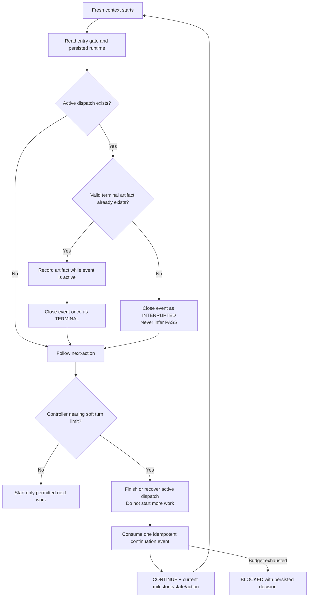
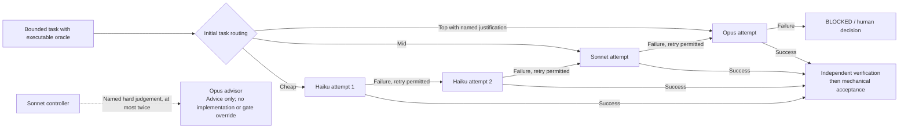
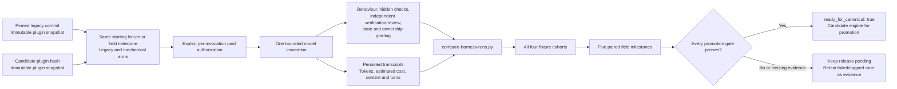

# How the mechanical harness works

The harness uses models to plan, implement, and judge code. Python commands own
workflow state, evidence checks, retry budgets, and acceptance. A Sonnet controller
coordinates **one milestone per invocation**; fresh worker, verifier, and reviewer
contexts provide separate implementation and checking.

This document describes the current cutover candidate. The diagrams show the
implemented workflow, not evidence that it has met the release cost targets.
Mermaid diagrams render directly on GitHub and in Markdown previews with Mermaid
support. Follow the source links below each diagram to inspect its contracts.

- [1. Complete workflow](#1-complete-workflow)
- [2. Who owns what](#2-who-owns-what)
- [3. Opening and running a milestone](#3-opening-and-running-a-milestone)
- [4. One task, including independent verification](#4-one-task-including-independent-verification)
- [5. Where evidence lives](#5-where-evidence-lives)
- [6. Retries, interruption, and fresh contexts](#6-retries-interruption-and-fresh-contexts)
- [7. Model routing and cost controls](#7-model-routing-and-cost-controls)
- [8. Release evidence](#8-release-evidence)

## 1. Complete workflow

Amber nodes involve a human decision, blue nodes involve model judgement, green
nodes are mechanical commands, and purple nodes are durable records. Colours are
supplementary; each node also names its responsibility.

```mermaid
flowchart TB
  subgraph agreement[Agree the work]
    U["Human: rough requirement"] --> R["roast-requirements<br/>Clarify behaviour, constraints and acceptance"]
    R --> Q{"Open questions resolved?"}
    Q -->|No| U
    Q -->|Yes| A["Optional architect<br/>Human agrees architecture for a new project"]
    A --> MVP["Optional scope-mvp<br/>Human agrees a useful first increment"]
    MVP --> INPUT[("Agreed requirements.md<br/>Optional architecture.md")]
  end

  subgraph preparation[Prepare once before execution]
    INPUT --> P["plan-milestones<br/>Fresh Sonnet milestone-planner"]
    P --> JSON["Temporary proposal<br/>Outcomes, requirements, components, criteria"]
    JSON --> INIT["harnessctl init-plan<br/>Validate coverage and IDs; lock and publish"]
    INIT --> STATE[("state.json + milestones.md<br/>TODO milestones, empty task lists")]
  end

  subgraph execution[Execute one current milestone]
    STATE --> ENTRY["implement / implement-mechanical<br/>Fresh Sonnet mechanical-controller"]
    ENTRY --> GATE["execution-status<br/>Compatibility and input checks"]
    GATE --> PREFLIGHT["Branch + phase-open + runtime-init<br/>Hook denial and foreground canary"]
    PREFLIGHT --> PLAN["Controller proposes scoped tasks<br/>register-plan validates them"]
    PLAN --> WORK["Fresh worker<br/>Implement and validate one task"]
    WORK --> VERIFY["Fresh verifier<br/>Inspect diff and run separate validation"]
    VERIFY --> ACCEPT["accept-task<br/>Check evidence and commit accepted paths"]
    ACCEPT --> MORE{"More tasks?"}
    MORE -->|Yes| WORK
    MORE -->|No| REVIEW["Fresh milestone reviewer<br/>Frozen diff and fresh validation"]
    REVIEW --> VERDICT{"Review verdict"}
    VERDICT -->|CHANGES_REQUIRED, budget available| FIX["register-correction-plan<br/>Own every blocking finding"]
    FIX --> WORK
    VERDICT -->|PASS| BUILT["Record as-built if architecture exists<br/>Otherwise record not-required"]
    BUILT --> CLOSE["phase-close<br/>Completion gates and closing commit"]
  end

  CLOSE --> DONE["DONE: stop this invocation<br/>Next milestone needs a fresh context"]
  VERDICT -->|BLOCKED or exhausted budget| HUMAN["BLOCKED<br/>Persist the required human decision"]
  GATE -->|Incompatible legacy work| LEGACY["Stop without mutation<br/>Finish with pinned legacy plugin"]

  classDef human fill:#fff4d6,stroke:#a36a00,color:#3d2a00
  classDef model fill:#e8f0fe,stroke:#3569b7,color:#122b50
  classDef machine fill:#e5f4e8,stroke:#328044,color:#14371c
  classDef record fill:#f0e8ff,stroke:#7a52aa,color:#342047
  class U,A,MVP,HUMAN,LEGACY human
  class R,P,ENTRY,PLAN,WORK,VERIFY,REVIEW model
  class INIT,GATE,PREFLIGHT,ACCEPT,FIX,BUILT,CLOSE machine
  class INPUT,STATE record
```

This overview shows the successful task path and the review correction loop.
Task failures, preflight recovery, splitting, and interruption are expanded below.
Architecture and MVP scoping are optional; requirements and initial planning are
not. Existing valid plans are preserved. Initial planning does not append new
scope to an existing plan; later MVP activation currently stops before changing
active inputs.

Sources: [planning skill](../skills/plan-milestones/SKILL.md),
[initialization](../scripts/harnesslib/planning.py),
[controller](../agents/mechanical-controller.md).

## 2. Who owns what

The controller chooses the next permitted tool or agent call. It cannot accept a
claim merely because another agent says it succeeded. The command layer validates
state and evidence before applying a transition.

| Decision or invariant | Where it belongs |
| --- | --- |
| Is this a useful slice? Does code meet the intent? | Planner, worker, verifier and reviewer judgement, using agreed inputs and direct evidence. |
| Is the result current, in scope, correctly identified and backed by intact evidence? | Python checks over state, workspace snapshots, ledger entries and hashes. |
| May another agent start, and which budget does it consume? | Persisted runtime state and one-use permits, checked by hooks. |
| Which files may a worker change? | Task packet scope, edit hooks, and changed-path checks before acceptance. |
| Can the milestone close? | Mechanical review/completion gates; the controller calls the command. |
| Is a navigation hit proof of correctness or complete blast radius? | No. Agents inspect the cited code; fallback text hits are explicitly non-authoritative. |

Hook enforcement covers the installed tool protocol; prompt obligations and
semantic judgement still matter. A green command cannot prove an ambiguous
requirement, and this diagram does not treat shell restrictions as a general
operating-system sandbox.

Sources: [CLI](../scripts/harnessctl.py), [hooks](../hooks/hooks.json),
[runtime guard](../scripts/guard-runtime.py), [Bash guard](../scripts/guard-bash.py),
[navigation contract](../skills/implement/references/code-navigation.md).

## 3. Opening and running a milestone

`execution-status` runs before branch creation or dispatch. `next-action` then
selects a single action from persisted state. Initial project planning and
milestone task planning are separate operations.

Preflight proves that the hook actually denies the probe and that the foreground
canary returns the required nonce. Generic `dispatch-complete` must not close the
canary. If opening stopped before `runtime-init`, the entry gate explicitly
returns `INITIALIZE_RUNTIME` rather than allowing task planning to proceed.

A split creates two to four vertical children with exact ownership partitions;
the controller does not implement a child in the parent invocation. Initial
review uses the milestone baseline. A correction review freezes the previous
reviewed head as its new base and reviews the correction diff. At most two
correction cycles are registered before unresolved work blocks.

Sources: [entry/recovery gate](../scripts/harnesslib/execution.py),
[state/action selection](../scripts/harnesslib/state.py),
[runtime preflight](../scripts/harnesslib/runtime.py),
[review lifecycle](../scripts/harnesslib/review.py).

## 4. One task, including independent verification

The verifier runs in a fresh context and creates its own validation execution.
Both results are recorded while their dispatches remain active. Acceptance is a
separate command after verification; neither subagent commits the task.

This sequence assumes complete terminal contracts. A missing terminal field is
`INTERRUPTED`, not a successful result. On re-entry, the controller checks for a
valid already-written artifact before deciding whether to close an event as
interrupted. Task acceptance rejects stale workspace or changed evidence.

Sources: [worker](../agents/mechanical-worker.md),
[verifier](../agents/mechanical-verifier.md),
[task result integrity](../scripts/harnesslib/results.py),
[acceptance](../scripts/harnesslib/state.py).

## 5. Where evidence lives

The state file is the workflow authority. Full logs and reports stay in files;
controllers receive paths, hashes, verdicts and bounded summaries. Most resume
operations read durable records instead of replaying an agent conversation.

Validation ledger keys include purpose, so worker evidence cannot substitute for
verifier or reviewer evidence. Worker, verifier, reviewer and milestone validation
always execute freshly. Only diagnostic validation under the historical purpose
name `orchestrator` can reuse an identical intact ledger entry; that name does
not dispatch a retired agent.

Initialization uses a project lock, staged validation, file replacement and an
`.initializing` marker. Ordinary write failures roll back. An interrupted
publication is detected and blocks execution until recovery; two file replacements
are not presented as one crash-atomic filesystem transaction.

Sources: [ledger](../scripts/harnesslib/ledger.py),
[initial publication](../scripts/harnesslib/planning.py),
[review result contract](../skills/implement/references/mechanical-review-result.md).

## 6. Retries, interruption, and fresh contexts

Task status, dispatch completion, milestone status and the controller's return
contract are different records. For example, `CONTINUE` ends a controller
invocation; it does not mean the milestone became DONE.

The controller starts stopping at tool turn 18 and has a hard cap of 22 turns.
There are four persisted continuation events. Soft turn counting is an agent
instruction; the runtime cap and persisted budgets are separate controls.
Advisor consultations, dispatches and review cycles also consume persisted
budgets. A fresh context does not reset those budgets. Recovery for the canary
uses `preflight-complete`, the exception to ordinary dispatch closure.

Sources: [runtime budgets and dispatch events](../scripts/harnesslib/runtime.py),
[controller return contracts](../agents/mechanical-controller.md),
[task retry logic](../scripts/harnesslib/state.py).

## 7. Model routing and cost controls

The ladder represents task attempts. Workers and verifiers are separately
invoked at the persisted task routing; their default agent definitions use Haiku.
A verifier failure can also reject the task and move it along the ladder.
The reviewer has a Sonnet floor and can use Opus when the relevant substantive
work requires it. An old high-tier task outside the current correction scope
does not by itself force that correction review to Opus.

| Control | Intended cost effect | Quality boundary retained |
| --- | --- | --- |
| Python lifecycle commands | Avoid repeated model interpretation of status and rules. | Commands validate transitions and evidence. |
| Separate initial planner | Keep project decomposition out of each execution context. | Complete requirement/component ownership. |
| One milestone and fresh continuation contexts | Bound accumulated context traffic. | Durable state and budgets survive. |
| Scoped packets and navigation locations | Limit repeated broad reads. | Agents inspect actual code and affected interfaces. |
| Cheap-first justified routing | Reserve larger models for harder work or failed attempts. | Separate verification and review remain. |
| Path-only results and bounded summaries | Keep full logs out of controller context. | Hashed artifacts remain available for inspection. |
| Foreground dispatch, no polling | Avoid turns spent waiting or notification re-entry. | Hook/canary preflight and one-use permits. |

Sources: [routing ladders](../scripts/harnesslib/state.py),
[review tier selection](../scripts/harnesslib/review.py),
[advisor contract](../agents/mechanical-advisor.md).

## 8. Release evidence

The harness's target-project workflow stops at the milestone's local closing
commit. Pushing or merging that target project is the user's integration decision.
Separately, releasing this plugin's cutover requires paired evaluation evidence.

Required targets include at least 35% median estimated cost savings, at least 20%
median token savings, at most 15% parent/controller traffic, coordination median
at most 22 turns, and coordination contexts no larger than 160k tokens. Accuracy,
independent checks, ownership, polling, re-entry, duplication and hard-limit gates
must also pass. These are release requirements, not claimed measured results.

The current local evidence is **124 tests passing across 14 suites** and native
plugin validation. Paid field evidence and canonical promotion remain pending.
The comparison's control is pinned to a legacy commit, not whichever implementation
happens to be on `main` later.

Sources: [evaluation runbook](../.harness-dev/mechanical-evaluation-runbook.md),
[comparison gates](../.harness-dev/compare-harness-runs.py),
[operational gates](../.harness-dev/check-efficiency.py),
[recorded local validation](../.harness-dev/mechanical-cutover-validation.md).
