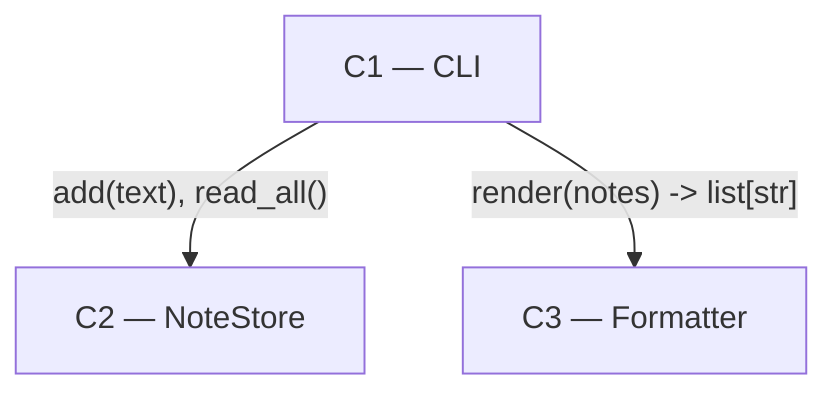

# Architecture

## Status

AGREED

## Overview

Three components: a command-line front end that parses arguments, a store that
owns the notes file, and a formatter that turns a list of notes into the lines
printed to stdout. Persistence is a JSON-Lines file because the requirements are
single-user, append-and-read only, and the standard-library-only constraint rules
out anything richer without cost.

## Diagram



## Components

### C1 — CLI

Responsibility: Parse `add` / `list` / `search` invocations, call the store and the formatter, write output and exit codes.
Location: `note/cli.py`, with `note/__main__.py` as the `python -m note` entry point.
Depends on: C2, C3
Realises: all three commands, empty-text rejection, exit codes.

### C2 — NoteStore

Responsibility: Own the notes file — append one note, read every note back in insertion order. No other component touches that file.
Location: `note/store.py`
Depends on: None
Realises: notes survive restart; missing storage file on first run.

### C3 — Formatter

Responsibility: Turn a list of notes into the exact lines printed to stdout, including the filtering applied by `search`.
Location: `note/format.py`
Depends on: None
Realises: `list` ordering, `search` filtering and its ordering.

## Interfaces

**C1 → C2** (in-process Python calls):

```python
def add(text: str) -> None
def read_all() -> list[str]
def storage_path() -> pathlib.Path
```

**C1 → C3** (in-process Python calls):

```python
def render(notes: list[str], term: str | None = None) -> list[str]
```

## Data

One JSON-Lines file, one note per line, owned entirely by C2. Location comes from
`storage_path()`.

## Technology Choices

| Choice | Decision | Why | Rejected |
| --- | --- | --- | --- |
| Persistence | JSON Lines file | Append-only, standard library, human-readable | sqlite3 (no query needs), pickle (not inspectable) |
| Search | Linear scan in C3 | Note counts are small and the requirement is substring match | An index (nothing asks for it) |

## Requirement Coverage

| Functional requirement | Component(s) |
| --- | --- |
| `note add <text>` | C1, C2 |
| `note list` | C1, C2, C3 |
| `note search <term>` | C1, C2, C3 |
| Notes survive restart | C2 |

## Risks

If note counts ever grow past a linear scan, C3's filtering becomes the
bottleneck and the store would need an index — which would move ownership of the
notes file's structure, so it is a C2 decision, not a C3 one.

## Open Architecture Questions

None

## Deviations

### D1 — Formatter component dropped

Milestone: M2
Change: Rendering stays inline in C1. `note/format.py` is never created and C3
does not exist in the implementation.
Reason: The only rendering needed turned out to be one line per note with no
decoration, so a component for it would be an abstraction with a single call site
— which the architecture's own rule forbids.
Material: yes
