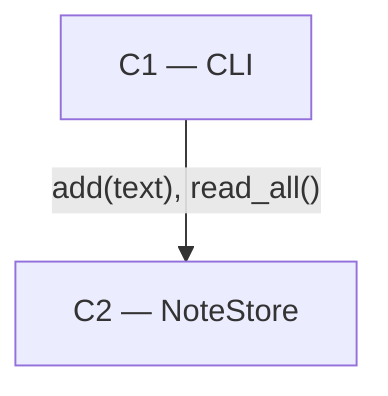

# As Built — M1

Baseline: the fixture's initial `baseline` commit
Change source: git diff

## Diagram

## Components Observed

| Id | Name | Files | Claimed? |
| --- | --- | --- | --- |
| C1 | CLI | `note/cli.py`, `note/__main__.py` | yes |
| C2 | NoteStore | `note/store.py` | yes |

## Edges Observed

| From | To | What crosses | Evidence |
| --- | --- | --- | --- |
| C1 | C2 | `store.add(text)` | `note/cli.py` `add` branch |
| C1 | C2 | `store.read_all()` | `note/cli.py` `list` branch |

## Unmapped Files

| File | Why it could not be attributed |
| --- | --- |
| `tests/test_note.py` | Test code; exercises C1 and C2 rather than constituting a component |

## Claim vs Observation

No mismatch.
