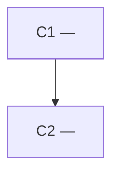

# `.harness/architecture.md` template

Write this file with these exact section headings, in this order.

````markdown
# Architecture

## Status

DRAFT | AGREED

## Overview

<2–4 sentences: the shape of the system and why it is shaped that way>

## Diagram



## Components

### C1 — <name>

Responsibility: <one sentence — if it needs two, it is probably two components>
Location: <path or module where it will live>
Depends on: <other component ids, or None>
Realises: <requirement references>

### C2 — <name>

...

## Interfaces

<what crosses each boundary: function signature, endpoint, message, schema.
One entry per boundary, naming the two components it sits between.>

## Data

<key data shapes, who owns them, where they persist (or "in memory only")>

## Technology Choices

| Choice | Decision | Why | Rejected |
| --- | --- | --- | --- |

## Requirement Coverage

| Functional requirement | Component(s) |
| --- | --- |

## Risks

<architectural risks and what would trigger revisiting them>

## Open Architecture Questions

None

## Deviations

<empty until implementation begins>
````

## Rules

- Set `## Status` to `AGREED` only after the human has explicitly agreed. Until
  then it is `DRAFT`, and the implement skill will refuse to start.
- Every entry in the requirements' `## Functional Requirements` must appear in
  `## Requirement Coverage`. A requirement with no component is an incomplete
  architecture.
- `## Diagram` is a **rendering of the sections below it, not a new decision**.
  One node per entry in `## Components`, labelled `C<n> — <name>`; one edge per
  `Depends on` reference, pointing from the dependent to the dependency; each
  edge labelled with the corresponding entry in `## Interfaces`. A node or edge
  that appears in the diagram and nowhere in the text — or the reverse — means
  the document contradicts itself, and that is a defect in the document rather
  than a stylistic choice.
- Keep the diagram to components. Files, classes and functions belong to the
  implementation, and a diagram that tracks them is out of date on the first
  commit.
- Component ids (`C1`, `C2`, …) are stable. Milestones reference them, so
  renumbering an existing component breaks that link — add new ids instead.
- Do not add a per-component status field. Progress against the architecture is
  derived from milestone status in `.harness/milestones.md`; a second status
  field would be redundant state that drifts.
- This file is not a design essay. If a section has nothing real to say, leave
  it empty rather than filling it with prose.

## Deviations

Recorded during implementation, when the code needs to differ from what was
agreed. Deviating is allowed; deviating silently is not.

```markdown
### D1 — <what changed>

Milestone: M<n>
Change: <what the implementation does instead>
Reason: <what was learned that the architecture did not anticipate>
Material: yes | no
```

- `Material: yes` means the change alters a component boundary, a technology
  choice, or which component owns a responsibility. Material deviations need
  human agreement before the milestone completes — the orchestrator must not
  approve a redesign on its own authority.
- `Material: no` covers changes that leave the agreed structure intact, and the
  orchestrator may record them itself.
